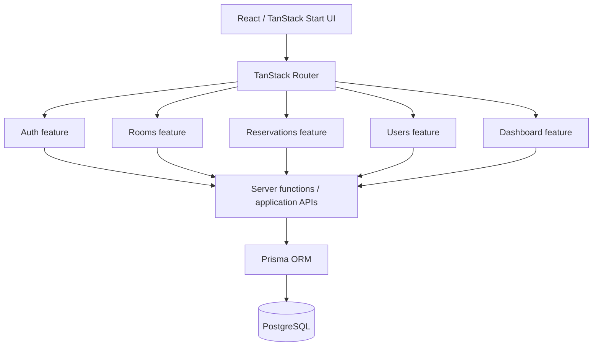
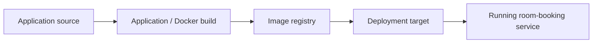

# Application Architecture

## System purpose

Go Reserve / FILKOM Room Booking is a web application for room discovery, reservation requests, reservation review, and role-specific operational views.

The retained GitHub source uses a feature-oriented TypeScript structure rather than a single monolithic page layer.



## Main functional areas

### Authentication and roles

The current retained source contains server-side authentication logic using:

- normalized email lookup;
- bcrypt password verification / hashing;
- `ADMIN` and `MAHASISWA` roles;
- application session handling.

The course proposal originally mentioned Google OAuth using UB accounts. That is an **intended design item**, while the current verifiable source implements application-managed email/password authentication. The portfolio does not label the retained implementation as Google OAuth.

### Room management

Admin-facing room workflows include room creation, editing, listing, and supporting metadata used by the student booking flow.

### Reservations

The reservation service supports:

- reservation creation;
- reservation history;
- Admin approval / rejection;
- cancellation states;
- aggregate status counts;
- room/time collision validation.

The overlap check evaluates existing `PENDING` and `APPROVED` reservations before accepting a new request. This is the concrete implementation behind the project's double-booking prevention claim.

### Admin / Student views

The retained branch evidence includes separate Admin and Student dashboards plus screenshots for room browsing, booking history, reservation review, room management, and user management.

## Data model boundary

Prisma is used as the persistence abstraction over PostgreSQL. The core domain visible in the source consists of:

```text
User
  ├── role
  └── reservations

Room
  └── reservations

Reservation
  ├── user
  ├── room
  ├── start / end time
  ├── purpose
  └── status
```

## Delivery boundary

The application architecture and delivery architecture should be read as two layers:



The recovered course pipeline uses Jenkins + Docker Hub + AWS EC2. The current main branch also contains a later GitHub Actions + Vercel workflow, which is documented separately rather than blended into the historical Jenkins path.

## Engineering discussion points

For a larger production deployment, useful extensions would include transactional booking constraints, stronger server-side authorization around every mutation, database-level protection against race-condition double booking, audit trails for Admin decisions, health checks, structured logging, metrics, backups, and horizontally scalable deployment.

These are design recommendations; they should not be read as features already present in the coursework build.
