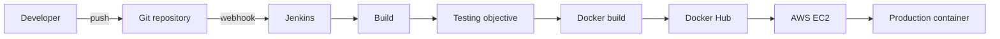

# CI/CD Pipeline

## Intended course architecture

The original project proposal defines Jenkins as the primary automation server for the FILKOM room-booking application.



## Recovered implementation evidence

The historical `feature/jenkins` branch preserves a real `Jenkinsfile`. Its retained stages are:

```text
Clone
Build
Push to Docker Hub
Deploy to AWS
```

The pipeline uses:

- `checkout scm` to obtain the application source;
- `docker build` for image creation;
- Jenkins `usernamePassword` credentials for Docker Hub authentication;
- `docker push` to publish the application image;
- Jenkins `sshagent` for the deployment key;
- SSH into the target server;
- `deploy.sh` on the target server to replace the running container.

Original artifact:

- [`feature/jenkins/Jenkinsfile`](https://github.com/syifaniads/AutomationServices/blob/feature/jenkins/Jenkinsfile)

## What the recovered Jenkinsfile does not prove

The course proposal describes automated **build, testing, Docker image build, push, and deployment**. However, the recovered Jenkinsfile does **not** contain an explicit `Test` stage.

That distinction matters:

- testing was part of the intended project scope;
- the historical `feature/testing` branch exists and contains UI evidence;
- the current `main` branch now defines `bun run test` as `vitest run`;
- but the retained Jenkinsfile cannot be used as evidence that Vitest was executed by Jenkins during the original course deployment.

A recruiter-facing repository should preserve this gap rather than adding a fictional historical test stage.

## Current alternative workflow

The current `main` branch also contains:

- [`.github/workflows/deploy.yml`](./.github/workflows/deploy.yml)

This is a later **GitHub Actions → Vercel** deployment path. It is useful repository history, but it is not the same pipeline as the Jenkins/Docker Hub/AWS EC2 coursework flow.

The two workflows should therefore be interpreted separately:

```text
Course CI/CD evidence:
Git -> Jenkins -> Docker Hub -> AWS EC2

Later repository workflow:
GitHub Actions -> Vercel
```

## Production improvements

If rebuilding this pipeline today, the most important improvements would be:

1. add a mandatory lint/test stage before image publication;
2. tag images using commit SHA instead of only `latest`;
3. use `docker buildx` / immutable registry tags;
4. publish test reports and build artifacts;
5. add an application health check after deployment;
6. fail deployment when the health check fails;
7. preserve the previously healthy image for rollback;
8. enable SSH host-key verification rather than disabling it;
9. use least-privilege credentials and rotate deployment secrets;
10. add deployment observability and notifications.

These are **production-readiness recommendations**, not claims about the historical coursework implementation.
