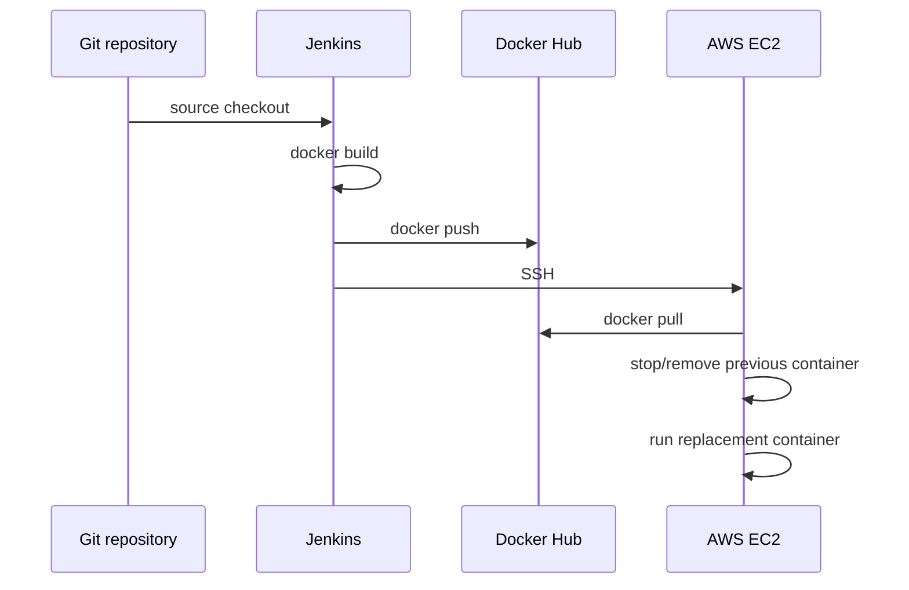

# Docker and AWS Deployment

## Recovered container build

The historical `feature/jenkins` branch includes a Dockerfile that builds the TanStack/Bun application for production.

Original artifact:

- [`feature/jenkins/Dockerfile`](https://github.com/syifaniads/AutomationServices/blob/feature/jenkins/Dockerfile)

Its retained flow is:

```text
oven/bun:1-alpine
    ↓
copy package metadata + Prisma
    ↓
bun install
    ↓
copy application source
    ↓
bun run build
    ↓
expose port 3000
    ↓
node .output/server/index.mjs
```

This gives the Jenkins pipeline a reproducible application artifact instead of deploying an unbuilt working tree directly.

## Recovered deployment helper

The same branch contains:

- [`feature/jenkins/deploy.sh`](https://github.com/syifaniads/AutomationServices/blob/feature/jenkins/deploy.sh)

The script performs a straightforward replace-in-place deployment:

1. pull the latest image from Docker Hub;
2. stop the previous container if it exists;
3. remove the previous container;
4. start the new image on host port 80 -> container port 3000;
5. inject server-side configuration from `.env`;
6. configure the container with an automatic restart policy.

The branch also contains a small Compose definition:

- [`feature/jenkins/docker-compose.yml`](https://github.com/syifaniads/AutomationServices/blob/feature/jenkins/docker-compose.yml)

## Jenkins -> EC2 handoff

The retained Jenkinsfile uses `sshagent` with an AWS SSH key credential and remotely invokes the deployment script on the EC2 host.



## What is retained vs what is not

Retained GitHub evidence confirms that the pipeline and deployment configuration were authored and stored in the project history.

The current public GitHub repository does **not** retain:

- historical Jenkins build logs;
- an AWS console screenshot tied to the deployment;
- a current EC2 endpoint;
- the institutional GitLab pipeline history that may have existed during the course.

Therefore the portfolio documents the configuration and workflow without claiming that an AWS environment is still online today.

## Production-readiness review

The historical flow is suitable as a small academic deployment, but a stronger production pipeline would improve several areas:

- immutable image tags (`git SHA`) rather than only `latest`;
- image vulnerability scanning;
- post-deploy health checks;
- rollback on failed health verification;
- load balancer / TLS termination;
- zero- or low-downtime replacement instead of stop-then-run;
- database migration strategy;
- centralized logs and metrics;
- SSH host-key verification;
- secrets from a managed secret store rather than long-lived local `.env` where possible.

These improvements are recommendations, not historical implementation claims.
