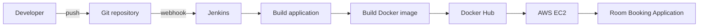
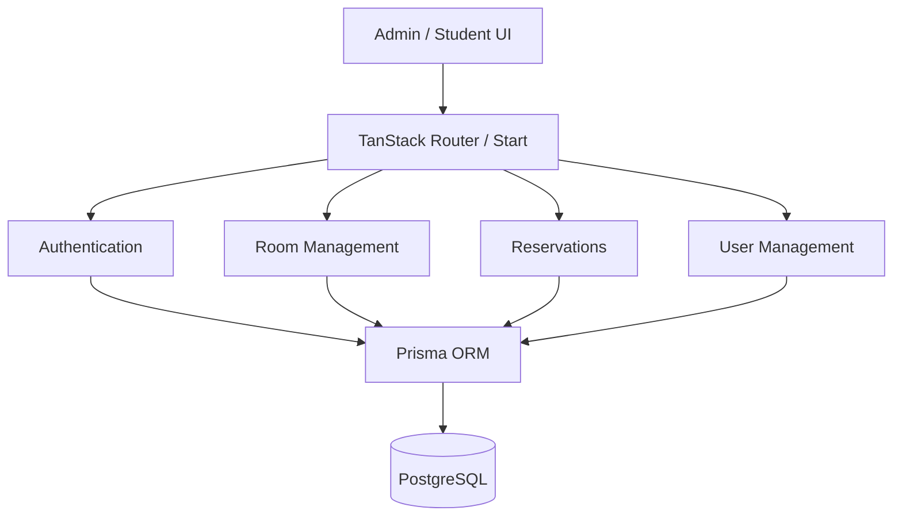

# FILKOM Room Booking — Jenkins CI/CD Automation

[](./CI_CD.md)
[](./DEPLOYMENT.md)
[](./DEPLOYMENT.md)
[](./ARCHITECTURE.md)

A collaborative DevOps coursework project that combines a **FILKOM room-booking web application** with an automated delivery workflow built around **Jenkins, Docker, Docker Hub, and AWS EC2**.

The public GitHub repository preserves the application source and several historical branches from the project. The most important CI/CD artifacts were recovered from `feature/jenkins`, while UI validation screenshots and project documentation were recovered from `feature/testing`.

> **Portfolio note:** this README distinguishes what is present in the retained GitHub history from what was proposed in the original project document. A legacy FILKOM GitLab repository may have contained additional material, but it is not currently available for verification and is therefore not treated as evidence here.

## Project goal

The course proposal defines the intended delivery flow as:



The goal was to reduce manual deployment steps and make application delivery more repeatable and consistent.

## What is verifiable in this repository

### Application

The retained application is a TypeScript room-reservation system built with:

- TanStack Start / React
- Bun and Vite
- PostgreSQL
- Prisma ORM
- TanStack Query
- role-aware Admin / Student interfaces
- room management
- reservation approval / rejection
- reservation history
- schedule-conflict prevention

The current reservation service checks overlapping `PENDING` and `APPROVED` bookings before creating a new reservation, so the double-booking rule is implemented in application logic.

### Historical Jenkins delivery path

The `feature/jenkins` branch preserves:

- `Jenkinsfile`
- `Dockerfile`
- `deploy.sh`
- `docker-compose.yml`

The recovered Jenkins pipeline contains the following stages:

```text
Clone
  ↓
Build Docker Image
  ↓
Push to Docker Hub
  ↓
SSH Deploy to AWS EC2
```

Docker Hub credentials are referenced through Jenkins Credentials, while AWS deployment uses an SSH credential binding.

See [CI_CD.md](./CI_CD.md) and [DEPLOYMENT.md](./DEPLOYMENT.md).

### Historical testing / UI evidence

The `feature/testing` branch preserves project-specific documentation and screenshots for:

- Admin Dashboard
- Student Dashboard
- room browsing
- booking success / rejection flows
- booking history
- room management
- user management
- Admin and Student login views

See [docs/SCREENSHOTS.md](./docs/SCREENSHOTS.md).

## Important evidence distinction

Some details evolved after the proposal was written.

| Area | Proposal / intended design | Retained GitHub evidence |
|---|---|---|
| CI/CD orchestrator | Jenkins | Jenkins pipeline exists on `feature/jenkins` |
| Containerization | Docker | Dockerfile + deploy script exist on `feature/jenkins` |
| Registry | Docker Hub | Jenkinsfile pushes a Docker image to Docker Hub |
| Target server | AWS EC2 | Jenkinsfile contains SSH-based AWS deployment flow |
| Testing | Build + testing in pipeline | historical Jenkinsfile does **not** contain an explicit Test stage; current `main` exposes `vitest run` |
| Authentication | Google OAuth UB proposed | retained current source uses application email/password authentication with bcrypt + session logic |
| Alternate deployment | not part of original proposal | current `main` also contains a later GitHub Actions → Vercel workflow |

This repository does not silently rewrite these differences. They are documented so a reviewer can distinguish the original objective, retained implementation, and later repository evolution.

## Application architecture



See [ARCHITECTURE.md](./ARCHITECTURE.md).

## Repository navigation

| Topic | Document |
|---|---|
| Application architecture | [ARCHITECTURE.md](./ARCHITECTURE.md) |
| Jenkins pipeline | [CI_CD.md](./CI_CD.md) |
| Docker / AWS deployment | [DEPLOYMENT.md](./DEPLOYMENT.md) |
| Testing evidence and gaps | [TESTING.md](./TESTING.md) |
| UI screenshot evidence | [docs/SCREENSHOTS.md](./docs/SCREENSHOTS.md) |
| Evidence provenance | [SOURCE_EVIDENCE.md](./SOURCE_EVIDENCE.md) |
| Team attribution | [TEAM_ATTRIBUTION.md](./TEAM_ATTRIBUTION.md) |
| Limitations / non-claims | [LIMITATIONS.md](./LIMITATIONS.md) |
| Security considerations | [SECURITY.md](./SECURITY.md) |
| CV / portfolio copy | [PORTFOLIO.md](./PORTFOLIO.md) |

## Local development

```bash
bun install
cp .env.example .env
bun run db:generate
bun run db:push
bun run db:seed
bun dev
```

Required local values are represented by `.env.example`; real credentials should never be committed.

## Testing

The current main branch defines:

```bash
bun run test
```

which runs Vitest. Historical project evidence is discussed separately because the earlier `feature/testing` snapshot used a placeholder test command and the recovered Jenkinsfile does not contain a dedicated Test stage.

See [TESTING.md](./TESTING.md).

## Team and attribution

This was a **three-person collaborative course project** completed by:

- Syifani Adillah Salsabila
- Latifa Anggia Fitriana
- Jonathan Salim

This personal repository is maintained as portfolio evidence and does not claim sole authorship of every source file or historical commit. Some commits are associated with teammate GitHub identities, which is consistent with collaborative development.

See [TEAM_ATTRIBUTION.md](./TEAM_ATTRIBUTION.md).

## Legacy GitLab note

The project appears to have also used a FILKOM-managed GitLab environment. That repository is not currently accessible from this portfolio reconstruction, so this GitHub case study uses only material that can still be verified from:

1. the retained GitHub branches;
2. current application source;
3. the original course proposal.

If the institutional GitLab becomes accessible again, its build logs, pipeline history, deployment evidence, and missing source can be reconciled into [SOURCE_EVIDENCE.md](./SOURCE_EVIDENCE.md) without changing the evidence standard used here.

---

**Project type:** DevOps / CI/CD Automation / Full-stack coursework  
**Context:** FILKOM Universitas Brawijaya — 2025/2026
